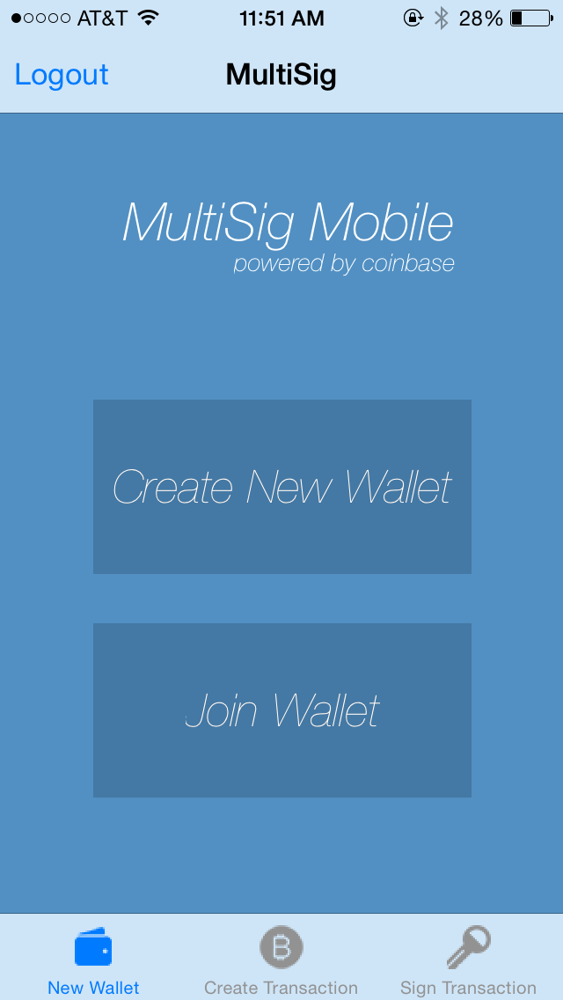
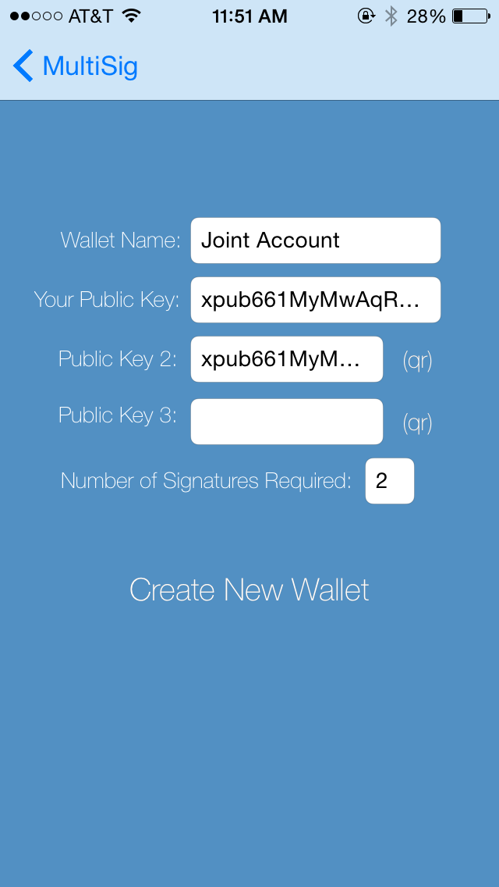
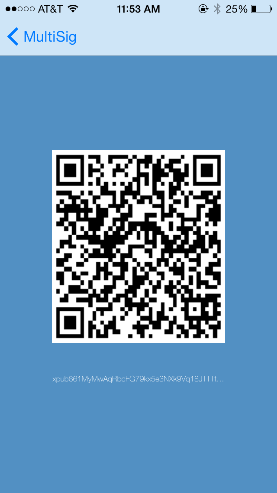
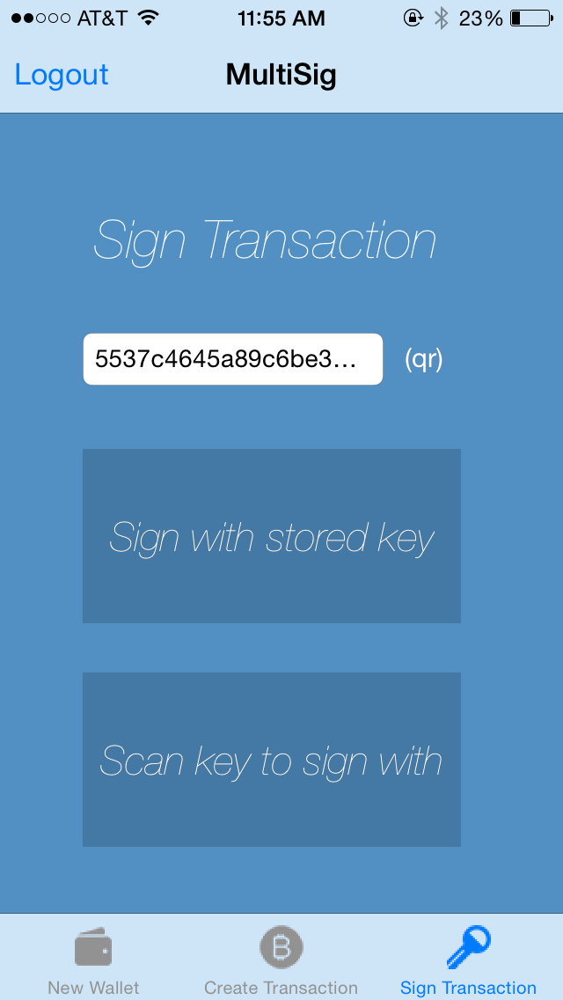

# MultiSig
## A mobile, multisignature Bitcoin wallet powered by Coinbase
- [Motivation](#motivation)
- [Libraries Used](#libraries)
- [Architecture](#architecture)
- [Screenshots](#screenshots)
- [Extensions](#extensions)

### Disclaimer
**NOTE:** This is a proof of concept. Use at your own risk, and only deposit any funds you can risk losing. 

### Motivation
Multisignature wallets are a huge feature of Bitcoin. The use cases are endless--from multiperson escrow to shared accounts. There is currently no good option for mobile multisignature wallets. 

### Libraries
For dependency management, [Cocoa pods](https://cocoapods.org/) were used. All dependencies can be installed by running `pod install` from the root directory. The project can then be opened with `open MultiSig.xcworkspace`. 

[Core bitcoin](https://github.com/oleganza/CoreBitcoin) was used for all crypto. This library is used to generate hiearchical deterministic wallets (explained in [BIP32](https://github.com/bitcoin/bips/blob/master/bip-0032.mediawiki)). It is also used to generate key pairs from that wallet, to sign transactions, and read/generate QR codes.

The [Coinbase SDK](https://github.com/joshbeal/coinbase-ios-sdk) is used to interact with a user's Coinbase account. Coinbase is used to keep track of signatures and propogate transactions.

[SSKeychain](https://github.com/soffes/sskeychain) is used to securely store private keys in the iOS keychain. 

### Architecture

This app is a proof of concept that demonstrates multisignature wallets and transactions on an iOS device. We aimed to balance wallet security with ease of coding--that is, we used Coinbase for transaction propogation to avoid implementing a full Bitcoin wallet. The user first must have an account with Coinbase--the app is not functional without an account. Once the user has authorized the app with their Coinbase account, he is then presented with create wallet, create transaction, and sign transaction views. If it is the user's first time running the app, then a HD wallet is created and stored in his keychain. Otherwise, the wallet is recreated from the keychain. To create a wallet, the user may input or scan up to 3 HD wallet extended public keys. The keychain extended public key is defaulted to one key. These extended public keys are then sent to Coinbase along with the number of signatures required and name of the wallet. Coinbase stores these public keys and opens a new multisig wallet under the user's account. To create a new transaction, the user first must select the multisig wallet he wishes to use.  Then, he can input or scan a bitcoin address to send funds to, and an amount. If all inputs are valid, then Coinbase returns with a transaction id. The transaction is now in limbo--Coinbase holds onto the transaction until enough signatures are collected. With this transaction id, other users can now download the "sighashes" and sign them with their own private keys. They then post these sighashes back to Coinbase, which signs and releases the transaction after the correct number is posted. If signatures are not posted in a certain amount of time Coinbase will automatically prune the transaction. Although a full bitcoin wallet is preferable, this implemntation limits giving total wallet control to Coinbase. 

### Screenshots

### Extensions

* Options for more public keys / required signatures
* Generate new public key
* Display shared account info
* Interface directly with bitcoin network and bypass Coinbase
 
